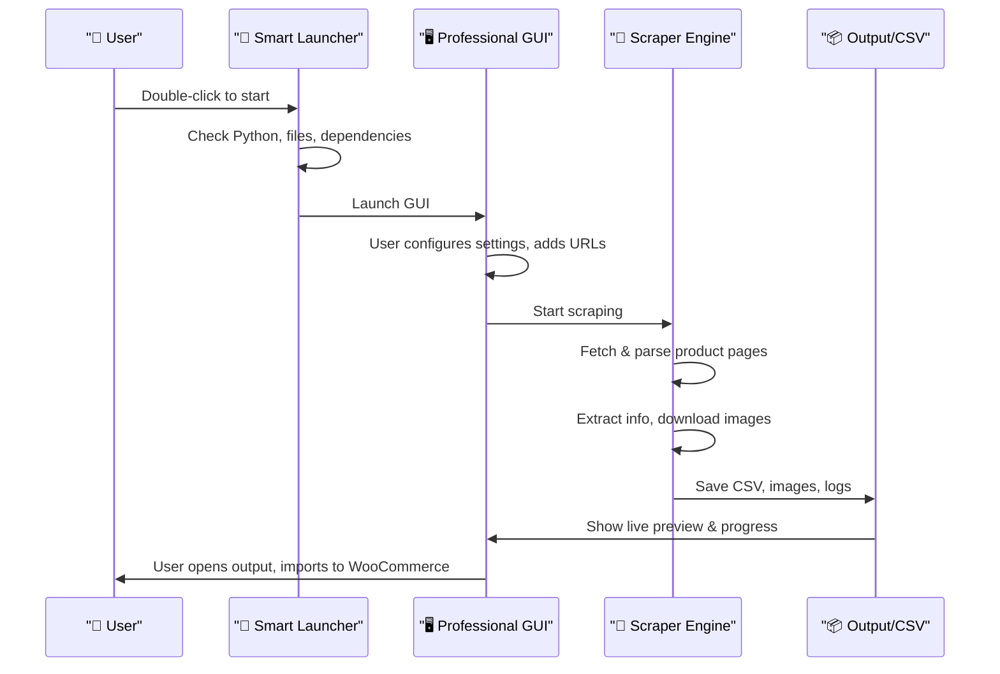

# 🚀 1688 Product Scraper - Smart Launcher & Professional GUI

A powerful, intelligent tool to scrape product data from 1688.com and prepare it for WooCommerce import. Includes a Smart Launcher for one-click setup and a professional GUI for advanced control. **100% FREE – No API keys, subscriptions, or payments required.**

---

## 🖼️ Workflow Diagram



---

## 🎯 One-Click Smart Launcher

The Smart Launcher is a comprehensive, intelligent launcher that automatically handles everything needed to run the 1688 Product Scraper.

### How to Use
- **Option 1: Double-Click Python File (Recommended)**
  - File: `Smart Launcher.py`
  - Double-click to start
  - The launcher will automatically check everything
  - Click "🚀 Launch Professional GUI" when ready
- **Option 2: Batch File**
  - File: `Launch Smart Scraper.bat`
  - Double-click to start

### Smart Features
- **First-Time Setup (Automatic):**
  - Python Version Check (3.7+)
  - File Validation (all required files)
  - Dependency Installation
  - Directory Creation
  - Component Testing
  - Progress Tracking
- **Fast Subsequent Launches:**
  - Configuration Caching
  - Instant Launch
  - Smart Detection (only re-checks if files change)
- **Error Handling:**
  - Comprehensive Validation
  - User-Friendly Messages
  - Automatic Recovery
  - Detailed Logging

---

## 🖥️ Professional GUI Features

### Advanced Settings Panel
- File management (input/output)
- Translation settings (English/Arabic)
- Scraping speed control
- URL limits and delays
- Output organization

### Real-time Progress Tracking
- Live progress bar
- Current product display
- Success/failure statistics
- Detailed logging

### Live Results Preview
- CSV data in table format
- Product image preview
- Excel integration
- Output folder access

### Multi-language Support
- English interface
- Arabic interface
- Dynamic language switching
- Localized messages

### Advanced Output Features
- WooCommerce ready CSV
- JSON backup files
- Timestamped folders
- Comprehensive error logging

---

## 📁 Files Overview

```
Your Project Folder:
├── 🚀 Smart Launcher.py              # Smart launcher (double-click)
├── 🎯 Launch Smart Scraper.bat       # Batch file launcher
├── 🚀 professional_gui.py            # Professional GUI
├── 📋 urls.txt                       # Your product URLs
├── 📄 requirements.txt               # Python packages
├── ⚙️ launcher_config.json           # Setup status (auto-generated)
├── woocommerce_1688_scraper.py       # Core scraping logic
├── run_scraper.py                    # Command line runner
├── lang.json                         # Multi-language translations
├── output/                           # Generated CSV files
├── logs/                             # Log files
└── images/                           # Screenshots and diagrams
```

---

## 🚀 Quick Start

1. **Double-click `Smart Launcher.py`**
2. Wait for first-time setup to complete
3. Click "Launch Professional GUI"
4. Add URLs and configure settings
5. Start scraping and monitor progress
6. Check output folder for CSV files

---

## 🔍 First-Time Setup Process

1. **Python Check**
   - Verifies Python 3.7+ is installed
   - Shows current version
   - Provides download link if needed
2. **File Validation**
   - Checks all required files exist:
     - professional_gui.py
     - woocommerce_1688_scraper.py
     - run_scraper.py
     - requirements.txt
3. **Dependency Installation**
   - Installs required packages:
     - requests, beautifulsoup4, cloudscraper, translators, pillow, lxml
4. **Directory Creation**
   - Creates necessary folders:
     - output/, logs/, temp_downloads/, product_images/
5. **Component Testing**
   - Tests all scraper imports
   - Validates functionality
   - Ensures everything works

---

## ✨ Full Feature List

- **No API keys, no subscriptions, no limits!**
- **Professional GUI**: Easy to use, powerful, and supports English & Arabic
- **WooCommerce-ready output**: Import products instantly
- **Advanced error handling and logging**
- **Live previews and analytics**
- **Organized output and backups**
- **Multi-language support**
- **Robust, production-grade codebase**


## 📋 Usage Instructions

### 1. Setting Up URLs
1. Open the Professional GUI
2. Go to the "Main Scraper" tab
3. Add 1688.com product URLs (one per line)
4. Use "Validate URLs" to check for errors
5. Save URLs to file for future use

### 2. Configuring Settings
1. Go to the "Settings" tab
2. **File Settings**: Choose input file and output folder
3. **Translation Settings**: Select output and translation languages
4. **Scraping Settings**: Set delay and URL limits
5. **Output Settings**: Configure file organization
6. **Advanced Settings**: Error handling and update options
7. Click "Save Settings"

### 3. Running the Scraper
1. Go to "Main Scraper" tab
2. Click "Start Scraping"
3. Monitor progress in real-time
4. View logs for detailed information
5. Check "Results Preview" tab for output

### 4. Managing Results
1. **CSV Preview**: View scraped data in table format
2. **Image Preview**: Browse product images
3. **Export Options**: Open in Excel, access output folders
4. **Backup Files**: JSON backups for data recovery

---

## 🚨 Troubleshooting & FAQ

### Common Issues
- **Smart Launcher doesn't start:**
  - Check Python (3.7+)
  - Check files are in the same folder
  - Run as administrator if needed
  - Check antivirus (may block Python execution)
- **Setup fails:**
  - Check internet connection
  - Check disk space
  - Check Python PATH
  - Try manual install: `pip install -r requirements.txt`
- **GUI doesn't launch:**
  - Check logs for error messages
  - Restart launcher
  - Check dependencies
  - Contact support if issues persist
- **No Images Extracted:**
  - Images are automatically filtered for quality
  - Check network connection
  - Verify URL accessibility
- **Translation Issues:**
  - Disable auto-translation in settings
  - Check internet connection for translation service
  - Use manual language selection

### Error Logs
- Check `logs/errors_*.log` for detailed error information
- Review `logs/scraper_*.log` for operation details
- Use GUI log viewer for real-time monitoring

---

## 🔄 Updates & Changelog

- **v2.2** (2025-07-11):
  - Merged Smart Launcher and Scraper documentation
  - Added real workflow diagram image
  - Improved structure and clarity
- **v2.1** (2025-07-11):
  - Added workflow diagrams and visual showcase to README
  - Added changelog and update log
  - Improved documentation and feature highlights
- **v2.0** (2025-07-10):
  - Professional GUI with advanced features
  - Multi-language support (English/Arabic)
  - Live CSV and image preview
  - Robust error handling and logging
- **v1.5**:
  - Enhanced scraper with better error handling
  - Improved image and description extraction
- **v1.0**:
  - Basic GUI and core functionality

---

## 📞 Support

- **Email:** yoseabdallah866@gmail.com
- **Website:** https://rakmyat.com/
- **GitHub:** https://github.com/yousefabdallah171/1668-product-scraper-to-woocommerce-without-api

---

**Enjoy your smart, professional 1688 product scraper!**

*Developed with ❤️ by Rakmyat for the WooCommerce community*
